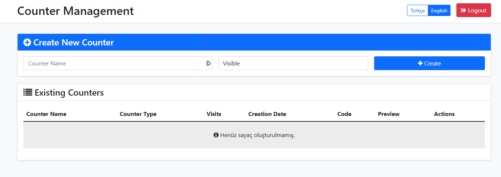

<div align="center">
  
  <h1>Ziyaretçi Sayacı Sistemi | Visitor Counter System</h1>
</div>

[English version below](#visitor-counter-system)

Web siteleri için modern ve özelleştirilebilir ziyaretçi sayacı sistemi. Farklı stillerde birden fazla sayaç oluşturun ve tekil ziyaretçileri takip edin.

## Özellikler

- 🔢 Çoklu sayaç desteği
- 🎨 İki farklı sayaç stili (görünür/gizli)
- 🌐 Çoklu dil desteği (Türkçe/İngilizce)
- 📊 Tekil ziyaretçi takibi
- 🔒 Güvenli yönetici paneli
- 💻 Tek satır kod ile kolay entegrasyon
- 📱 Responsive tasarım

## Gereksinimler

- PHP 7.4 veya üzeri
- MySQL 5.7 veya üzeri
- PDO PHP Eklentisi
- GD PHP Eklentisi

## Kurulum

1. Depoyu klonlayın
```bash
git clone https://github.com/fyildirim-debug/visitor-counter.git
```

2. Dosyaları web sunucunuza yükleyin
3. Alan adınızı ziyaret edin ve kurulum sihirbazını takip edin
4. Yönetici hesabı oluşturun
5. Sayaç oluşturmaya başlayın!

## Kullanım

Yönetici panelinde bir sayaç oluşturduktan sonra, şuna benzer bir kod alacaksınız:
```html

```

Bu kodu web sitenizde sayacı görüntülemek istediğiniz yere ekleyin.


## Katkıda Bulunma

Pull request'ler kabul edilir. Büyük değişiklikler için lütfen önce neyi değiştirmek istediğinizi tartışmak için bir konu açın.

---

# Visitor Counter System

A modern and customizable visitor counter system for websites. Create multiple counters with different styles and track unique visitors.

## Features

- 🔢 Multiple counter support
- 🎨 Two different counter styles (visible/hidden)
- 🌐 Multi-language support (English/Turkish)
- 📊 Unique visitor tracking
- 🔒 Secure admin panel
- 💻 Easy integration with single line of code
- 📱 Responsive design

## Requirements

- PHP 7.4 or higher
- MySQL 5.7 or higher
- PDO PHP Extension
- GD PHP Extension

## Installation

1. Clone the repository
```bash
git clone https://github.com/fyildirim-debug/visitor-counter.git
```

2. Upload files to your web server
3. Visit your domain and follow the setup wizard
4. Create admin account
5. Start creating counters!

## Usage

After creating a counter in admin panel, you'll get a code like this:
```html

```

Just add this code to your website where you want to display the counter.


## Contributing

Pull requests are welcome. For major changes, please open an issue first to discuss what you would like to change.

## Author | Geliştirici

**Furkan YILDIRIM**

- Website: [furkanyildirim.com](https://furkanyildirim.com)
- GitHub: [@fyildirim-debug](https://github.com/fyildirim-debug)
- Email: [posta@furkanyildirim.com](mailto:posta@furkanyildirim.com)

## License | Lisans

This project is licensed under the MIT License - see the [LICENSE](LICENSE) file for details

Bu proje MIT Lisansı ile lisanslanmıştır - detaylar için [LICENSE](LICENSE) dosyasına bakın

[](http://fysunucu.com/profilecounter/counter_badge.php?key=73c7df77b22257734237ee007f34060b)
